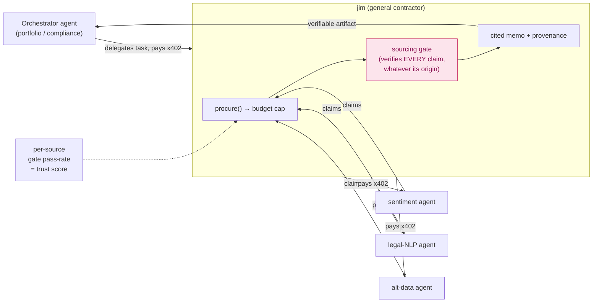

# jim — Agent Interop (should jim talk to other agents?)

*Short answer: jim already does — and the gate is what makes it safe to do more.*

This doc answers the question "is there value in this agent talking to other
agents?" head-on. It's the deep dive behind [ROADMAP Phase 7](ROADMAP.md) and the
agent-economy thread in [ENTERPRISE_VISION.md](ENTERPRISE_VISION.md).

> **jim is already an A2A participant.** It **sells** research to other agents over
> x402 (HTTP routes, an MCP server, Bazaar discovery — [Phase 5](BUILD_PLAN.md)) and
> it **buys** on-chain data from The Graph over x402 inside a single request
> ([ARCHITECTURE §2.2](ARCHITECTURE.md#22-buy-side-jim--upstream-inside-one-request)).
> It is simultaneously a *producer* and a *consumer* agent. The interesting question
> isn't *whether* to talk to other agents — it's *how much further to lean in, and
> what has to be true for it to be safe.*

---

## 1. The four protocols (jim already speaks three)

An agent economy needs four distinct capabilities. People conflate them; keeping
them separate is the whole game.

| Capability | Protocol | jim today |
|---|---|---|
| **Pay** another agent for a service | x402 (USDC / EIP-3009 on Base) | ✅ both legs — sell + buy |
| **Expose tools** an agent can call | MCP | ✅ `jim-mcp`, x402-gated ([mcp_server.py](../src/jim/marketplace/mcp_server.py)) |
| **Discover** services without a registry | x402 Bazaar | ✅ first settle auto-indexes ([ADR-0003](adr/0003-bazaar-discovery.md)) |
| **Delegate a *task*** to a peer agent | A2A (agent cards, task lifecycle) | ⬜ the one gap — [ROADMAP Phase 7](ROADMAP.md) |

The distinction that matters: **MCP exposes *tools*; A2A delegates *tasks*.** Calling
`research_fundamentals(AAPL)` is a tool call — synchronous, you know the shape.
"Produce a diligence packet on this merchant" is a task — it may take minutes, fan
out to sub-agents, and come back as a structured artifact. jim's engine is already
task-shaped (gather → debate → synthesize → gate → judge); publishing an **agent
card** next to the existing `/.well-known/x402` manifest is what lets a peer
*delegate* to it rather than just *call* it.

---

## 2. Two directions of value

### 2.1 jim as a subcontractor (hired by orchestrators)

A customer's **portfolio agent**, **trading agent**, or **compliance agent** calls
jim for the cited-research leg of a larger job. This is the demand the agent-tier
pricing and Bazaar discovery already target.

> **Why they'd pick jim over a raw LLM call: provenance.** An orchestrator that has
> to defend a decision — to a user, a risk committee, a regulator — can show "this
> was based on cited SEC filings, gate-verified," not "the model said so." jim's
> output is *safe to act on* because every number is traceable. That is the entire
> value of being a verifiable subcontractor.

### 2.2 jim as a general contractor (hires sub-agents)

The bigger unlock. Today jim's only paid upstream is The Graph. Tomorrow it pays
**specialized peer agents** for inputs it can't produce itself — and marks up the
synthesis:

- a **sentiment agent** (news/social → a cited sentiment signal),
- a **legal-NLP agent** (parse 10-K risk factors / litigation),
- an **alt-data agent** (satellite, shipping, card-spend panels),
- a **filings agent** for non-US / IFRS jurisdictions.

Each is just a new `Source` ([ARCHITECTURE §5](ARCHITECTURE.md#5--sources--the-source-interface))
that gathers over x402/MCP and flows through the **same `procure()` → budget →
cache** path. jim becomes a *composer*: buy many narrow signals, verify them,
synthesize one cited memo, resell. The "buy a datum once, resell derived insight
many times" economics ([ARCHITECTURE §6.3](ARCHITECTURE.md#63-store-store))
generalize directly to "compose many bought signals."

> **Comparative advantage.** An economy of narrow, verifiable agents beats one
> monolith. jim should *not* grow a sentiment model or an OCR stack — it should
> **buy** them and stay world-class at the one thing it's best at: turning signals
> into provably-cited analysis. A2A is how specialization compounds.

---

## 3. The gate is the composition-safety primitive

This is the part most agent-economy designs miss, and it's jim's edge.

When you compose untrusted agents, **hallucinations compound across hops**: agent A
fabricates a number, agent B builds on it, jim resells it, the orchestrator acts on
it. There is no human in the loop to catch it. The naive fix — "trust your
subcontractors" — doesn't scale and isn't auditable.

jim already has the antidote: **the sourcing gate doesn't care where a claim came
from.** A figure from a paid sub-agent must match a cited fact within tolerance, or
it fails the gate exactly like a self-hallucination
([ARCHITECTURE §7](ARCHITECTURE.md#7--the-sourcing-gate-deep-dive)). So jim can ingest
output from agents it doesn't trust and *still* only ship what it can verify.

That gives jim two things almost no other agent has:

1. **Safe composition** — buy from anyone; the gate is the firewall.
2. **A native reputation primitive** — **per-source gate pass-rate** is a trust
   score jim *computes itself* from outcomes, not from a third-party rating. jim
   should prefer sources whose data its gate can actually verify, and stop paying
   ones whose pass-rate decays. Reputation by verification, not by reviews.

---

## 4. The risks (and what jim has vs. still needs)

A2A is not free. Here are the real failure modes, jim's existing defenses, and the
gaps to close.

| Risk | What goes wrong | jim's defense today | Gap to close |
|---|---|---|---|
| **Compounding hallucination** | fabricated claims propagate across hops | the sourcing gate verifies *every* figure regardless of origin | extend the gate's value-match to *qualitative* claims (the gate guards numbers, not narrative — see prompt-injection below) |
| **Prompt injection across boundaries** | a malicious source returns text crafted to steer jim's synthesizer | impersonal guard catches some output drift | explicit input-side injection check; treat all upstream *text* as hostile, not just verify its *numbers* |
| **Runaway spend loops** | A pays B pays C pays A; budget spirals | per-query `BudgetCap` (propose/dispose) | a **global per-call-graph ceiling + loop detector** ([ROADMAP Phase 7](ROADMAP.md)) — per-query isn't enough once jim subcontracts |
| **Sybil / collusion** | fake sources flood the market or collude to look reliable | gate pass-rate is outcome-based, hard to fake | source **identity** (who operates this agent) + allowlists + attestations |
| **Settlement / quality disputes** | bought signal turns out fabricated *after* you paid | budget cap limits exposure per call | refund/clawback mechanism + signed provenance attestations (EAS / verifiable credentials) |
| **Identity & sanctions** | you pay an agent you're not allowed to pay | — | OFAC screening on the counterparty before settle ([ENTERPRISE_VISION §3](ENTERPRISE_VISION.md)) |

> **The pattern that saves you is the one jim already lives by.** Every A2A risk is
> "an agent wants to do something; can you let it?" — and the answer is always
> *model proposes, deterministic code disposes*. A peer can propose data (the gate
> disposes), propose a purchase (the budget disposes), propose an action (a policy
> gate disposes). A2A doesn't need a new safety philosophy; it needs jim's existing
> one applied at the *boundary between agents* instead of inside one agent.

---

## 5. A worked example

A compliance team's orchestrator needs a diligence packet on a merchant before
onboarding.

1. **Orchestrator → jim** (A2A task, pays the agent-tier price over x402):
   *"Diligence packet on merchant X."*
2. **jim composes.** It pulls EDGAR fundamentals itself (free), then **subcontracts**:
   pays a legal-NLP agent for litigation history and a sentiment agent for a
   reputation signal — each a `Source`, each through `procure()` → budget cap, each
   capped by the per-call-graph ceiling.
3. **jim verifies.** Every figure from every subcontractor passes the sourcing
   gate; anything unverifiable is dropped, not shipped. The legal agent's
   pass-rate is updated.
4. **jim synthesizes** one cited, impersonal memo and settles its subcontractor
   bills; the margin ledger records `price_out − Σ sub-agent costs − inference`.
5. **Orchestrator receives** a provenance-complete artifact it can show its risk
   committee — every claim re-runnable to a source.

No human touched the chain, yet every number is auditable, spend was bounded at
every hop, and jim profited on the spread. *That* is the value of jim talking to
other agents.

---

## 6. Verdict

**Yes — and jim is unusually well-positioned for it**, because the hard problem of
agent-to-agent commerce isn't payment or discovery (x402 and Bazaar solve those);
it's **trusting what you buy**. jim's deterministic sourcing gate is a ready-made
firewall for composed, untrusted agent output, and its gate pass-rate is a
reputation primitive it computes from outcomes. The work to do (Phase 7):

1. **Source-as-agent** — let a `Source` be a peer agent over x402/MCP.
2. **Per-source trust scoring** — gate pass-rate becomes the routing signal.
3. **Cross-agent spend safety** — global ceiling + loop detection.
4. **An agent card** — so peers can *delegate tasks*, not just call tools.
5. **Boundary hardening** — input-side injection checks + counterparty identity.

The through-line, as everywhere in jim: *the model proposes, code disposes* — now
at the seam between agents.

---

## See also

- [ROADMAP.md](ROADMAP.md) — Phase 7 is the buildable slice of this
- [ENTERPRISE_VISION.md](ENTERPRISE_VISION.md) — why the agent economy is the giants' endgame
- [ARCHITECTURE §9](ARCHITECTURE.md#9-tools-function-tools-and-mcp) — tools & MCP, both directions
- [ADR-0003](adr/0003-bazaar-discovery.md) — discovery via the native Bazaar rail
