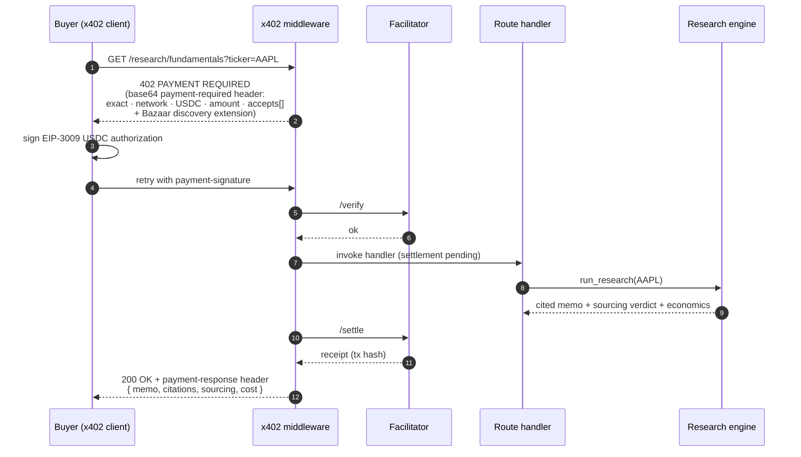
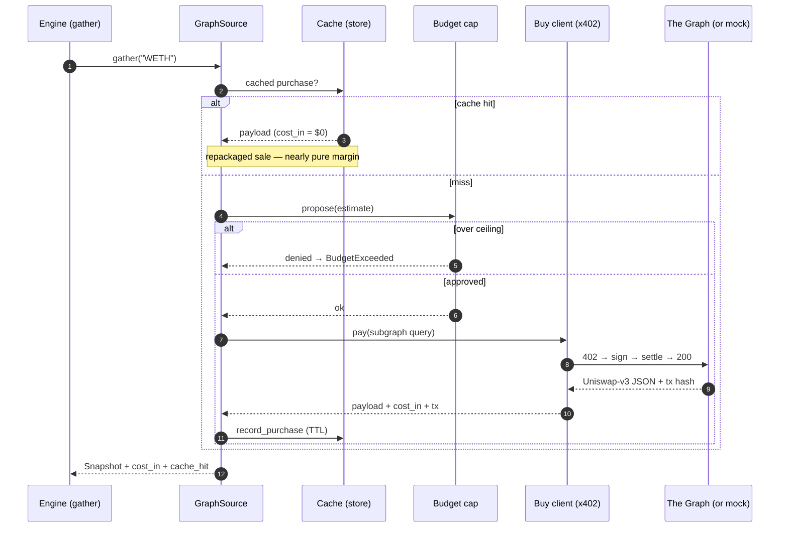
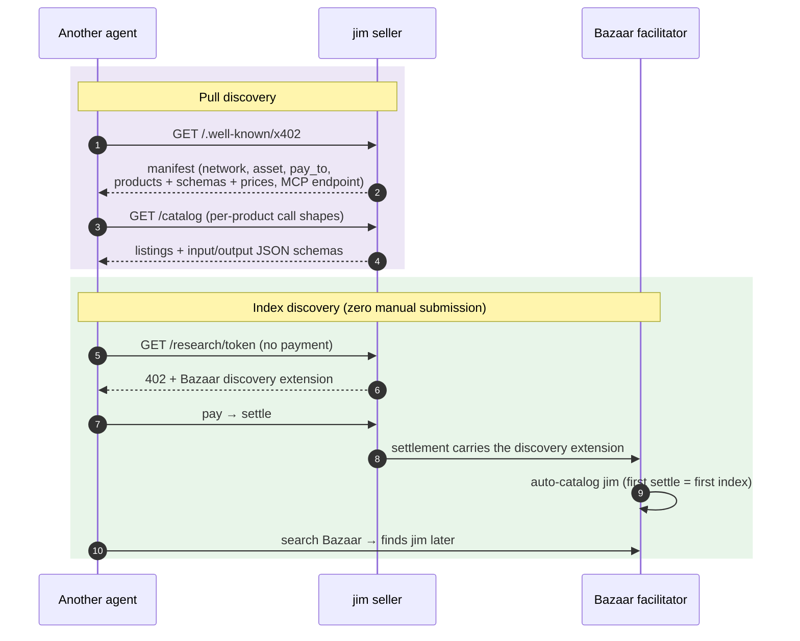
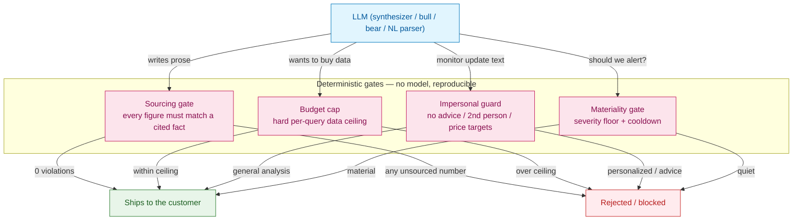
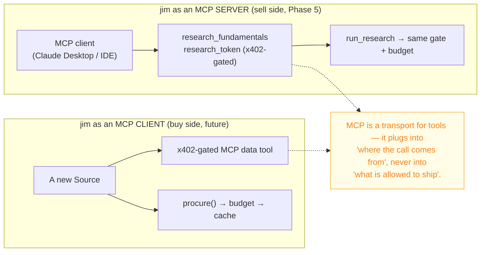
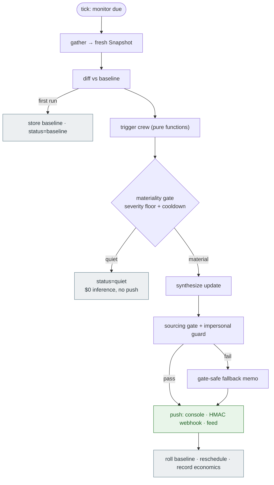
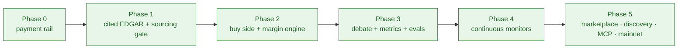

# jim — System Map

A visual tour of jim **as a whole**: how a request enters (over HTTP, MCP, or the
human UI), how it's discovered and paid for over x402, how the research engine
turns an identifier into a cited memo, where the deterministic trust gates sit,
which external tools the sources draw on, how the cache + margin ledger close the
economic loop, and how monitors run the whole thing continuously.

> These diagrams are hand-drawn for clarity. For a diagram of your **actual,
> live** configuration — current network, prices, which sources are paid, the
> store backend, feature flags — run `uv run jim-map` or open
> [`GET /map`](#the-live-map) on a running seller. See [the live map](#the-live-map).

Companion reading: [ARCHITECTURE.md](ARCHITECTURE.md) (the deep dive) and
[BUILD_PLAN.md](BUILD_PLAN.md) (the phases).

---

## 1. The whole system, one picture

Everything from buyers → discovery → payment rails → seller → engine → trust
gates → sources → external tools → store → monitors → observability.

```mermaid
flowchart LR
  subgraph buyers["① Buyers / clients"]
    mcpA["MCP agents<br/>(Claude, IDEs)"]
    httpA["HTTP / agent buyers<br/>(x402 clients)"]
    human["Human UI<br/>(/ — pays under the hood)"]
  end

  subgraph disc["② Discovery (Phase 5)"]
    cat["GET /catalog"]
    wk["GET /.well-known/x402<br/>(manifest)"]
    bz["Bazaar index<br/>(auto on 1st settle)"]
    mcpS["MCP server<br/>jim-mcp"]
  end

  subgraph pay["③ x402 payment rails"]
    mw["x402 middleware<br/>402 → verify → settle"]
    fac["Facilitator<br/>(testnet / CDP)"]
    usdc["USDC<br/>EIP-3009"]
  end

  subgraph sell["④ Seller — paid routes"]
    rf["GET /research/fundamentals"]
    rt["GET /research/token"]
  end

  subgraph eng["⑤ Research engine (LangGraph)"]
    gather["gather"]
    debate["debate<br/>bull ∥ bear → judge"]
    synth["synthesize<br/>(LLM memo)"]
    jf["faithfulness judge"]
  end

  subgraph trust["⑥ Deterministic trust gates (no LLM)"]
    gate["sourcing gate"]
    budget["budget cap<br/>propose/dispose"]
    imp["impersonal guard"]
  end

  subgraph src["⑦ Sources"]
    fsrc["FundamentalsSource<br/>(free)"]
    gsrc["GraphSource<br/>(PAID · x402)"]
  end

  subgraph ext["⑧ External tools / upstreams"]
    edgar["SEC EDGAR<br/>(public domain)"]
    yahoo["Yahoo charts<br/>(price/technicals)"]
    graph["The Graph / mock<br/>(Uniswap v3)"]
  end

  subgraph store["⑨ Store + margin ledger"]
    cache["cache (data_purchases)<br/>buy once · resell many"]
    ledger["margin ledger<br/>(query_records)"]
    insights["insights<br/>(pgvector)"]
  end

  subgraph mon["⑩ Monitors (Phase 4)"]
    sched["scheduler"]
    crew["trigger crew<br/>+ materiality gate"]
    notify["notify<br/>console · webhook · feed"]
  end

  subgraph obs["⑪ Observability"]
    lf["Langfuse<br/>(best-effort)"]
  end

  mcpA --> mcpS
  httpA --> wk
  httpA --> cat
  human --> rf
  mcpS --> mw
  cat --> bz
  wk --> bz
  bz -. "found you" .-> httpA

  mw --> fac --> usdc
  mw --> rf
  mw --> rt
  rf --> gather
  rt --> gather

  gather --> debate --> synth --> gate
  gate -- "fail → retry" --> synth
  gate -- "pass" --> jf

  gather --> fsrc --> edgar
  fsrc --> yahoo
  gather --> gsrc
  gsrc --> budget -- "dispose → buy (x402)" --> graph
  gsrc --> cache

  gather --> store
  jf --> ledger
  synth --> insights

  sched --> crew --> gather
  crew --> notify --> imp
  synth --> imp

  jf --> lf
  gate --> lf

  classDef trustcls fill:#fce4ec,stroke:#c2185b,color:#880e4f;
  class gate,budget,imp trustcls;
  classDef paycls fill:#fff3e0,stroke:#ef6c00,color:#e65100;
  class mw,fac,usdc paycls;
```

**How to read it.** A buyer arrives at ①, finds jim via ② (or just calls a known
URL), and pays through ③. The middleware only lets the request reach a ④ route
*after settlement*. The route runs the ⑤ engine, which writes prose but cannot
ship a number the ⑥ sourcing gate rejects. Data comes from ⑦ sources, which draw
on ⑧ external tools; paid data passes the ⑥ budget cap and is cached in ⑨ so the
*next* sale of the same datum is nearly pure margin. ⑩ monitors re-run the engine
on a cadence and only speak when the materiality gate says there's news. ⑪ traces
everything, best-effort.

---

## 2. Sell-side payment (customer → jim)

The x402 V2 cycle for one paid call.



---

## 3. Buy-side (jim → upstream, nested inside one request)

While serving a `token` request, jim becomes an x402 **buyer** — the `cost_in`
half of the margin equation. The budget *disposes*; the cache makes repeats free.



---

## 4. Marketplace discovery (Phase 5)

Two paths by which another agent finds jim and pays it — pull (manifest / MCP)
and index (Bazaar, automatic on first settlement). See
[ADR-0003](adr/0003-bazaar-discovery.md).



---

## 5. The trust boundary — model proposes, code disposes

jim's defining invariant, visualized. Three deterministic gates wrap every place
the model has latitude.



---

## 6. Tools & MCP — both directions

jim has **function-level tools** wired into a fixed graph (not model-chosen), and
is MCP-ready in both directions. See [ARCHITECTURE §9](ARCHITECTURE.md#9-tools-function-tools-and-mcp).



---

## 7. Monitor lifecycle (Phase 4 recap)

A monitor turns a one-shot call into a standing one — deterministic detection,
LLM only when there's news.



---

## 8. The build, phase by phase



---

## The live map

The diagrams above are static. To see **your** running system — the actual
network, prices, paid sources, store backend, and feature flags — generate one:

```bash
uv run jim-map                       # Mermaid (paste into any renderer / GitHub)
uv run jim-map --format html -o map.html   # self-contained page (mermaid.js)
uv run jim-map --format json         # the raw node/edge graph

# Or, from a running seller:
#   GET /map        → the rendered page in your browser
#   GET /map.mmd    → raw Mermaid source
#   GET /map.json   → the structured graph
```

Because `jim-map` reads config, it changes when you do: flip `GRAPH_LIVE=true`
and the token upstream repoints from the mock to Base mainnet; set `DATABASE_URL`
and the store node switches from in-memory to Postgres+pgvector; turn off
`ENABLE_DEBATE` and the debate node disappears. The map is the system telling you
what it currently is — not what a diagram once claimed it was.
